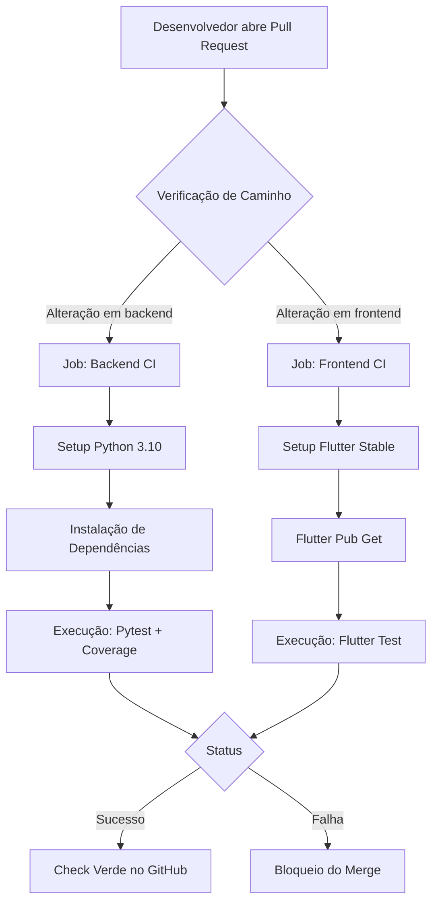
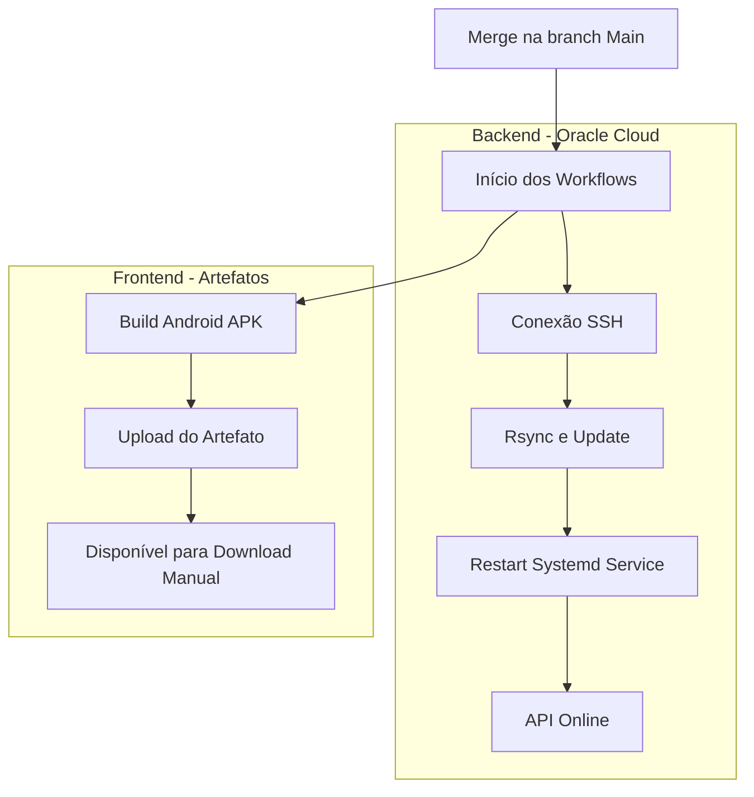

# Automação e DevOps

A estratégia de *DevOps* do projeto Lumina foi desenhada para suportar a arquitetura de **Monorepo**, garantindo que tanto o aplicativo móvel (*Frontend*) quanto a API (*Backend*) coexistam no mesmo repositório sem conflitos nos processos de automação. Para orquestrar esses fluxos, utiliza-se o **GitHub Actions**, assegurando que a verificação de qualidade e a entrega de software ocorram de forma padronizada e eficiente.

A automação é dividida em dois pilares fundamentais: a **Integração Contínua (CI)**, focada na validação imediata do código, e a **Entrega/Deploy Contínuo (CD)**, focada na atualização do ambiente de produção.

---

## Pipeline de Integração Contínua (CI)

Para otimizar o consumo de recursos e o tempo de *feedback*, os fluxos de trabalho de CI foram configurados com gatilhos condicionais (*path filters*). Isso significa que as rotinas de teste do Backend são executadas apenas quando há alterações no diretório correspondente, e o mesmo princípio se aplica ao Frontend.

### Fluxo de Verificação do Backend
Este fluxo assegura a integridade da lógica de negócios e das integrações de IA.

* **Gatilho:** *Push* ou *Pull Request* afetando o diretório `backend/`.

* **Ambiente:** Ubuntu Latest com Python 3.10.

* **Processo Automatizado:**

    1.  **Checkout:** Recuperação do código-fonte utilizando suporte a Git LFS.

    2.  **Preparação:** Instalação das dependências listadas no `requirements.txt`.

    3.  **Testes e Cobertura:** Execução da suíte de testes com **Pytest**, utilizando a biblioteca `pytest-cov` para garantir métricas de cobertura de código e `pytest-mock` para isolar serviços externos durante a validação.

### Fluxo de Verificação do Frontend
Este fluxo garante a estabilidade da interface e funcionalidades do aplicativo móvel.

* **Gatilho:** *Push* ou *Pull Request* afetando o diretório `frontend/`.

* **Ambiente:** Ubuntu Latest com Flutter (Canal Stable).

* **Processo Automatizado:**

    1.  **Gerenciamento de Pacotes:** Resolução de dependências via `flutter pub get`.

    2.  **Configuração de Ambiente:** Criação dinâmica e segura de variáveis de ambiente (`.env`) necessárias para o contexto de teste.

    3.  **Validação:** Execução de testes de unidade e testes de *widget* com geração de relatórios de cobertura (`flutter test --coverage`).

---

### Diagrama do Processo de CI

---

## Estratégia de Deploy e Entrega Contínua (CD)

Devido à natureza distinta dos componentes do sistema (Web Service versus Aplicativo Mobile), a estratégia de entrega foi segregada para atender aos requisitos específicos de cada plataforma.

### Backend: Deploy Automatizado na Oracle Cloud
A API do Lumina possui um pipeline de *Continuous Deployment* totalmente automatizado, eliminando a intervenção humana no servidor de produção.

* **Infraestrutura:** O backend é hospedado em uma instância virtual na **Oracle Cloud**.

* **Gatilho:** O *deploy* é iniciado automaticamente assim que um *Pull Request* é aprovado e mergeado na branch `main`.

* **Mecanismo de Atualização:** O GitHub Actions utiliza uma conexão segura via SSH para executar um *script* de atualização no servidor remoto. O processo envolve:

    1. Clonagem da versão mais recente do código em diretório temporário.

    2. Sincronização inteligente de arquivos via `rsync` (mantendo configurações sensíveis preservadas).

    3. Atualização das bibliotecas Python no ambiente virtual.

    4. Reinicialização do serviço `systemd` (`luminabackend.service`).

    5. Execução de um *Health Check* (teste de fumaça) para confirmar a disponibilidade da API.

### Frontend: Estratégia de Distribuição Mobile
O planejamento inicial do projeto contemplava o deploy automatizado diretamente na **Google Play Store**. A equipe realizou as etapas preliminares, incluindo o pagamento da taxa de registro de desenvolvedor e a configuração da conta na Google Play Console.

No entanto, enfrentaram-se obstáculos significativos relacionados aos **prazos de verificação de identidade e revisão da loja**, que se mostraram incompatíveis com o cronograma ágil da disciplina. Para mitigar esse risco e garantir que as entregas quinzenais fossem testadas, a equipe adaptou a estratégia para a **distribuição de artefatos diretos**:

* **Processo:** A partir da versão estável na branch `main`, são gerados os artefatos binários (`.apk`) do Android via GitHub Actions.

* **Distribuição:** Esses arquivos são disponibilizados diretamente aos *stakeholders* e à equipe, permitindo a instalação e validação imediata em dispositivos físicos sem depender da aprovação assíncrona da loja.

---

### Diagrama do Fluxo de Deploy

