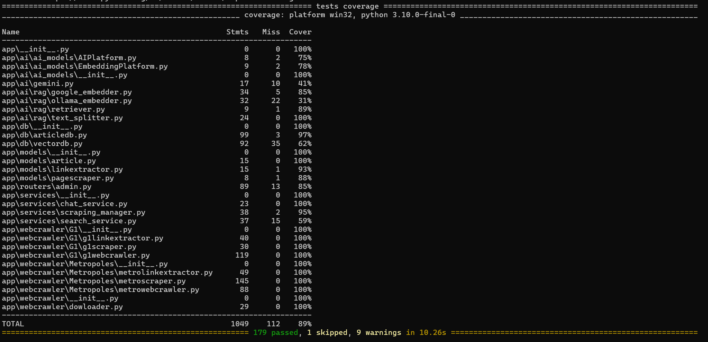
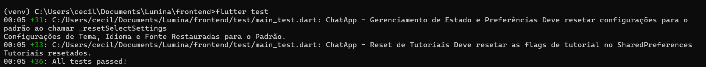
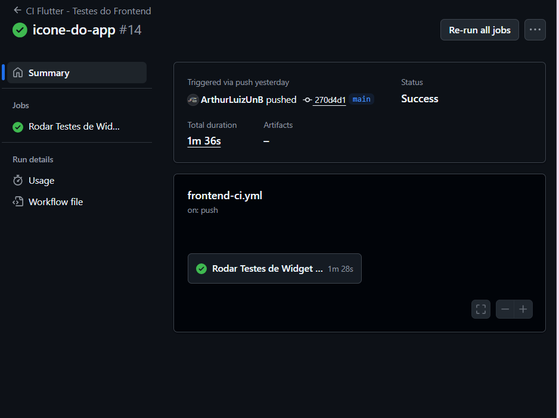

# Testes e Qualidade

A garantia de qualidade no projeto Lumina é assegurada através de uma estratégia de testes automatizados abrangente, validando desde regras de negócio isoladas até a integração completa dos sistemas. A execução é realizada localmente pelos desenvolvedores e auditada automaticamente via Integração Contínua (CI).

---

## Testes Unitários

### Backend (API)
* **Framework:** Utilizamos o **Pytest**, juntamente com `pytest-cov` para métricas e `pytest-mock` para isolamento.
* **Métricas Alcançadas:** O backend atingiu uma cobertura total de **89%** do código fonte, com **179 testes** executados com sucesso.
* **Destaques de Validação:**
    * **Core Business:** O serviço de chat (`chat_service.py`) e os extratores de notícias (`webcrawler/G1`, `webcrawler/Metropoles`) possuem **100% de cobertura**, garantindo a confiabilidade das principais funcionalidades do sistema.
    * **Banco de Dados:** As camadas de persistência de artigos (`articledb.py`) foram validadas para garantir a integridade dos dados salvos.

### Frontend (Mobile)
* **Framework:** Utilizamos o **Flutter Test**, nativo do SDK.
* **Escopo de Testes:** Foram implementados **36 casos de teste** focados em:
    * **Interface (Widget Testing):** Validação visual e interativa das telas principais, como `ChatScreen` e `LandingPage`.
    * **Gerenciamento de Estado:** Verificação da lógica de preferências do usuário e reset de configurações, assegurando que o estado da aplicação se comporte como esperado durante o ciclo de vida de uso.

---

## Testes de Integração

Os testes de integração visam garantir que os componentes do sistema conversem corretamente entre si.

* **Fluxos Testados:**
    * **API Endpoints:** Utilizamos o `TestClient` do FastAPI para simular requisições HTTP reais. Arquivos como `test_main_crud.py` validam se as rotas respondem com os códigos de status corretos (200, 404, 500) e se os dados trafegam corretamente entre o *Controller* e o *Service*.
    * **Scrapers e Parsers:** A integração entre o download do HTML e a extração do conteúdo textual foi validada nos testes dos crawlers (`test_g1scraper.py`, `test_metroscraper.py`), garantindo que mudanças no layout dos sites fonte sejam detectadas.

---

## Evidências

Abaixo estão os registros da execução bem-sucedida dos testes e métricas de qualidade atuais.

### Relatório de Cobertura Backend
A tabela abaixo demonstra a alta cobertura de testes nas camadas críticas da aplicação (Services, Crawlers e DB), totalizando 89% de linhas cobertas.

### Execução de Testes Frontend
Confirmação da execução bem-sucedida da suíte de testes do Flutter, validando 36 cenários distintos.

### Execução no Pipeline de CI (GitHub Actions)
A estabilidade do projeto é verificada automaticamente a cada alteração. Abaixo, as evidências de execução bem-sucedida para ambos os ambientes.

**Pipeline do Backend:**

**Pipeline do Frontend:**
