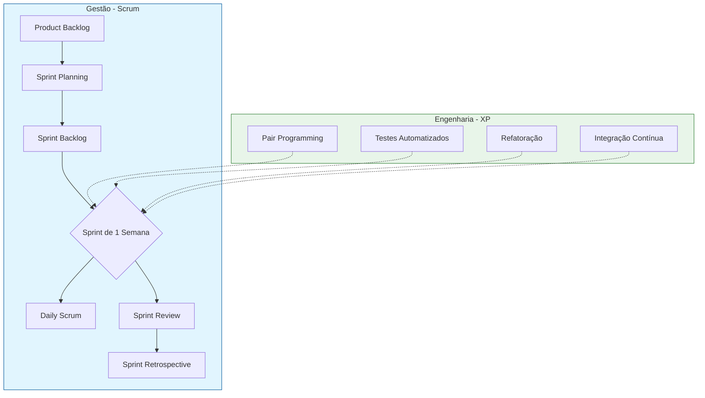

# Metodologia de Desenvolvimento

O projeto Lumina adota uma metodologia ágil híbrida, combinando a estrutura de gerenciamento iterativa do **Scrum** com as práticas técnicas de excelência do **Extreme Programming (XP)**. Essa abordagem permite que a equipe mantenha um ritmo de entrega constante e adaptável (foco do Scrum) enquanto assegura a qualidade técnica e a confiabilidade do código (foco do XP).

---

## Scrum: Gestão e Processo

O Scrum é utilizado como o *framework* principal para o planejamento e organização das tarefas do grupo. O desenvolvimento é dividido em ciclos curtos, permitindo *feedback* rápido e adaptação contínua às mudanças de requisitos.

* **Sprints Semanais:** O projeto opera em ciclos de trabalho (Sprints) com duração de **uma semana**. Essa periodicidade curta favorece a entrega contínua de valor e permite correções de rota ágeis.
* **Artefatos:**
    * **Product Backlog:** Lista priorizada de funcionalidades e requisitos do produto.
    * **Sprint Backlog:** Conjunto de tarefas selecionadas para serem executadas na Sprint vigente.
* **Ritos e Cerimônias:**
    * **Sprint Planning:** Reunião realizada no início da semana para definir o escopo de trabalho e estimar a complexidade das tarefas.
    * **Daily Scrum:** Alinhamento diário da equipe para monitorar o progresso e identificar impedimentos.
    * **Sprint Review & Retrospective:** Ao final da semana, a equipe valida o incremento produzido e discute melhorias para o processo de trabalho da próxima sprint.

---

## XP (Extreme Programming): Práticas de Engenharia

Para complementar a gestão do Scrum, adotamos práticas do XP focadas na qualidade intrínseca do software.

* **Integração Contínua (CI):** Todo código produzido é integrado frequentemente ao repositório principal e verificado por testes automatizados (via GitHub Actions), garantindo a estabilidade do *build*.
* **Testes Automatizados (TDD):** A escrita de testes (unitários e de integração) é parte fundamental do desenvolvimento, assegurando que novas funcionalidades não quebrem o sistema existente.
* **Programação em Pares (Pair Programming):** A equipe utiliza sessões de pareamento para resolver problemas complexos, compartilhar conhecimento sobre a base de código e realizar revisões em tempo real.
* **Refatoração Contínua:** O código é constantemente melhorado e limpo para manter a manutenibilidade e reduzir a dívida técnica, sem alterar seu comportamento externo.
* **Propriedade Coletiva do Código:** Qualquer membro da equipe tem autonomia para atuar em qualquer parte do sistema (Backend ou Frontend), fomentando a responsabilidade compartilhada sobre o produto.

---

### Diagrama da Metodologia Híbrida

