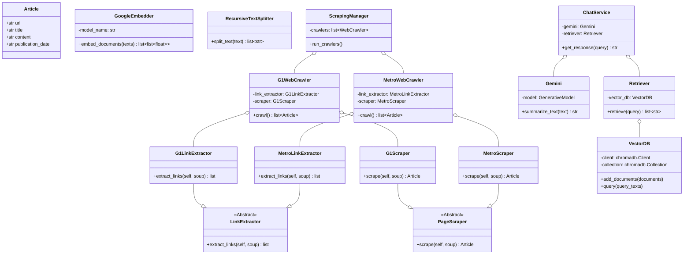

```mermaid
classDiagram
    class Article {
        +str url
        +str title
        +str content
        +str publication_date
    }

    class LinkExtractor {
        <<Abstract>>
        +extract_links(self, soup) list
    }

    class PageScraper {
        <<Abstract>>
        +scrape(self, soup) Article
    }

    class G1LinkExtractor {
        +extract_links(self, soup) list
    }
    G1LinkExtractor --|> LinkExtractor

    class G1Scraper {
        +scrape(self, soup) Article
    }
    G1Scraper --|> PageScraper

    class G1WebCrawler {
        -link_extractor: G1LinkExtractor
        -scraper: G1Scraper
        +crawl() list~Article~
    }
    G1WebCrawler o-- G1LinkExtractor
    G1WebCrawler o-- G1Scraper

    class MetroLinkExtractor {
        +extract_links(self, soup) list
    }
    MetroLinkExtractor --|> LinkExtractor

    class MetroScraper {
        +scrape(self, soup) Article
    }
    MetroScraper --|> PageScraper

    class MetroWebCrawler {
        -link_extractor: MetroLinkExtractor
        -scraper: MetroScraper
        +crawl() list~Article~
    }
    MetroWebCrawler o-- MetroLinkExtractor
    MetroWebCrawler o-- MetroScraper

    class VectorDB {
        -client: chromadb.Client
        -collection: chromadb.Collection
        +add_documents(documents)
        +query(query_texts)
    }

    class Gemini {
        -model: GenerativeModel
        +summarize_text(text) str
    }

    class GoogleEmbedder {
        -model_name: str
        +embed_documents(texts) list~list~float~~
    }

    class Retriever {
        -vector_db: VectorDB
        +retrieve(query) list~str~
    }
    Retriever o-- VectorDB

    class RecursiveTextSplitter {
        +split_text(text) list~str~
    }

    class ChatService {
        -gemini: Gemini
        -retriever: Retriever
        +get_response(query) str
    }
    ChatService o-- Gemini
    ChatService o-- Retriever

    class ScrapingManager {
        -crawlers: list~WebCrawler~
        +run_crawlers()
    }
    ScrapingManager o-- G1WebCrawler
    ScrapingManager o-- MetroWebCrawler

```
