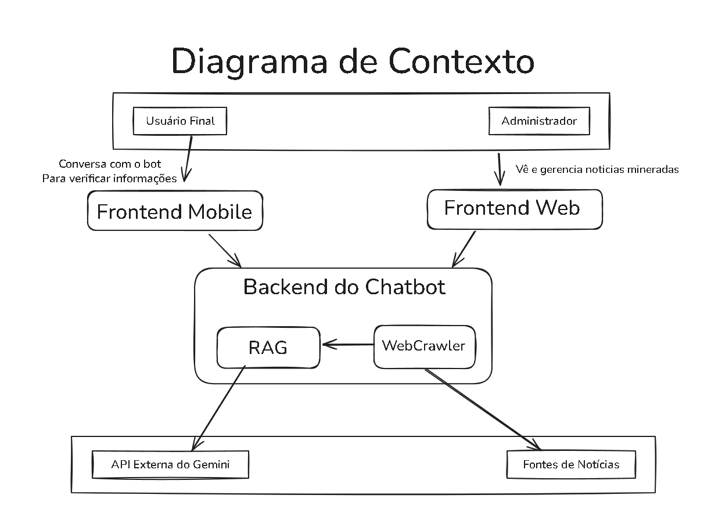
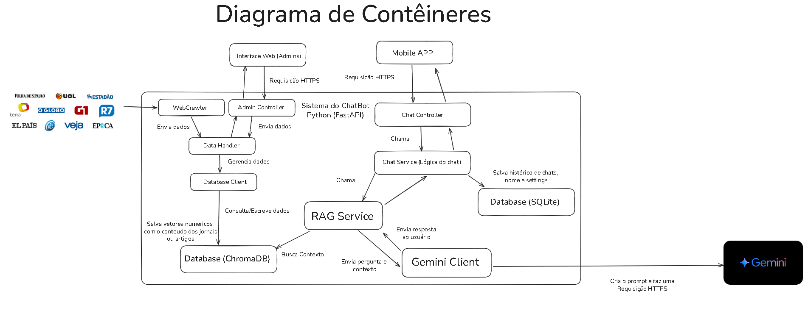
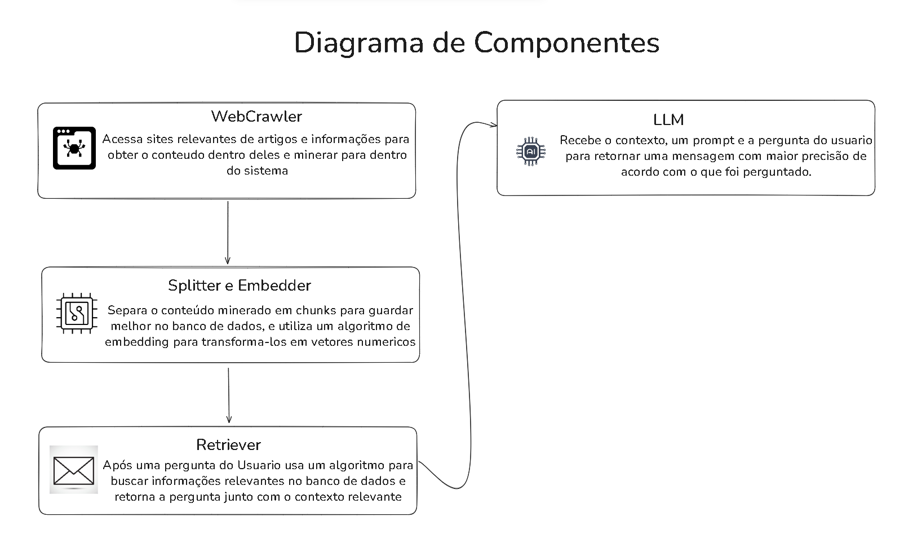

# Arquitetura do Sistema de Chatbot Anti-Fake News

Este documento descreve a arquitetura do Sistema de Chatbot Anti-Fake News. O objetivo principal do sistema é combater a desinformação, permitindo que usuários verifiquem notícias e façam perguntas, enquanto administradores gerenciam as fontes de dados. A aplicação foi projetada com foco em escalabilidade, manutenção e fácil gerenciamento da base de conhecimento.

## Diagramas da Arquitetura do Sistema

### Stack Tecnológica

- **Backend**: Python com o framework FastAPI
- **Frontend Mobile**: Aplicativo nativo desenvolvido em Flutter para Android e iOS
- **Frontend Web**: Interface de administração construída com HTML, JS e CSS, hospedada em GitHub Pages
- **Bancos de Dados**: ChromaDB para armazenamento de vetores e SQLite para dados locais do usuário no aplicativo móvel
- **IA/LLM**: API externa do Gemini (Google) para processamento de linguagem e geração de respostas
- **Outras Ferramentas**: Web Crawler (Python) para ingestão de dados

## Contexto

O diagrama a seguir ilustra a interação do sistema com seus principais atores e sistemas externos.

## Contêineres

Este diagrama detalha os principais "contêineres" do sistema, mostrando como eles se comunicam.

## Componentes

Este diagrama detalha o fluxo de dados e os principais componentes da lógica do sistema, com foco na pipeline de ingestão e na geração de respostas.

## Descrição dos Módulos e Componentes

### 1. Frontend Mobile: Aplicativo (Flutter)

**Função**: Camada de apresentação para o usuário final.

**Tecnologias**: Flutter.

**Responsabilidades**:

- Renderizar a interface de chat

- Coletar as perguntas do usuário e enviá-las para a API do Chatbot

- Exibir as respostas geradas

- Armazenar dados locais (histórico de conversas, dados do usuário) usando SQLite

### 2. Backend: API do Chatbot (FastAPI)

**Função**: Lógica de negócio e orquestração do sistema.

**Tecnologias**: Python, FastAPI.

**Responsabilidades**:

- Receber requisições da interface móvel e web
- Interagir com o Banco de Dados Vetorial (ChromaDB) para buscar contexto relevante
- Chamar a API Externa do Gemini (LLM) para gerar respostas
- Gerenciar a base de notícias (adicionar, remover, visualizar) através da interface de administração

### 3. Pipeline de Ingestão de Dados

**Função**: Coleta, processamento e armazenamento de novos artigos.

**Componentes**:

- **WebCrawler**: Acessa fontes de notícias e minera o conteúdo dos artigos
- **Splitter e Embedder**: Processa o conteúdo bruto. O splitter divide os artigos em pedaços menores (chunks) para melhor gerenciamento. O embedder transforma esses chunks em vetores numéricos, que são mais eficientes para busca por similaridade

**Responsabilidades**: Inserir os vetores processados no Banco de Dados Vetorial (ChromaDB).

### 4. Bancos de Dados

#### ChromaDB:
- **Função**: Armazenamento de vetores de artigos de notícias
- **Tipo**: Banco de dados vetorial
- **Responsabilidades**:

    - Receber os vetores gerados pelo Pipeline de Ingestão
    - Permitir buscas de alta velocidade por similaridade de texto, que são cruciais para a função de Retriever

#### SQLite:
- **Função**: Armazenamento de dados locais no dispositivo móvel
- **Tipo**: Banco de dados relacional (local)
- **Responsabilidades**:
    - Armazenar o histórico de conversas e as informações de login do usuário, garantindo uma experiência contínua e personalizada

### 5. Frontend Web: Interface de Administração (HTML/JS/CSS)

**Função**: Interface para gerenciar o sistema.

**Tecnologias**: HTML, JS, CSS.

**Responsabilidades**:

- Fornecer uma interface gráfica para que o administrador possa adicionar ou remover fontes de notícias
- Visualizar o estado da base de dados e o histórico de ingestões
- Interagir com a API do Chatbot para executar essas operações

### 6. Componentes de IA e Lógica (dentro da API)

#### Retriever:
- **Função**: Mecanismo de busca de contexto
- **Responsabilidades**: Receber a pergunta do usuário, convertê-la em um vetor e buscar no ChromaDB os vetores de artigos mais semelhantes. Retorna o conteúdo original desses artigos para ser usado como contexto

#### LLM (API Externa do Gemini):
- **Função**: Geração de respostas
- **Responsabilidades**: Receber a pergunta do usuário junto com o contexto fornecido pelo Retriever e um prompt específico. Com base nessas informações, gera uma resposta coesa e informativa, focada em desmentir ou confirmar a notícia

## Requisitos e Deploy

### Requisitos de Software

- Python 3.10+
- Flutter SDK
- FastAPI, Uvicorn, ChromaDB
- Bibliotecas para web scraping (ex: BeautifulSoup, Scrapy) e embedding (ex: Hugging Face)

### Deploy

- **Backend (API)**: Pode ser hospedado em um provedor de nuvem como AWS, GCP ou Azure. O uso de Docker pode simplificar o deploy
- **Frontend Mobile**: Os aplicativos serão publicados nas lojas Google Play Store e Apple App Store
- **Frontend Web**: A interface de administração será hospedada em uma plataforma de hospedagem estática, como GitHub Pages
- **Bancos de Dados**: O ChromaDB pode ser executado em um servidor dedicado na nuvem. O SQLite é local e faz parte do aplicativo móvel

---

Este documento de arquitetura serve como um mapa para o desenvolvimento do projeto, garantindo que todas as partes do sistema estejam alinhadas e se comuniquem de forma eficiente.
